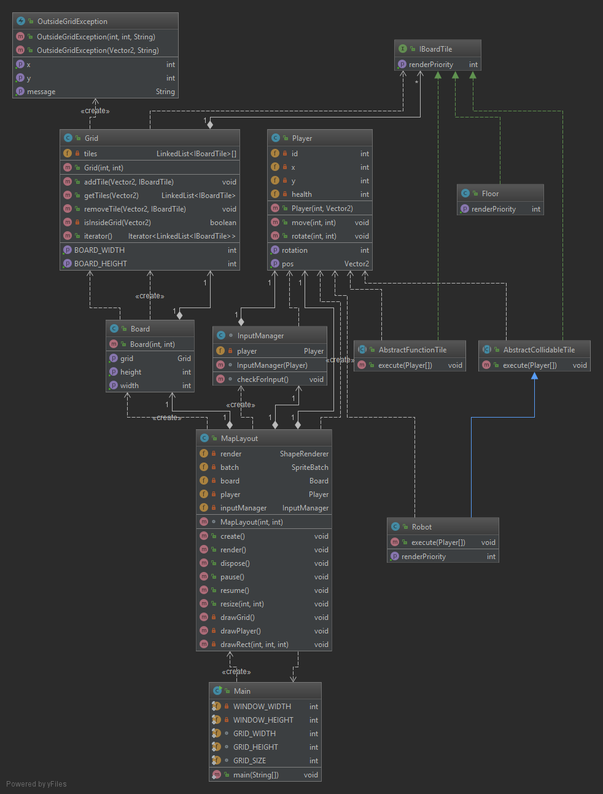

## Deloppgave 1: Organiser teamet
### Gruppenavn
  * Yellowbots

### Gruppeleder
  * Oskar

### Kundekontakt 
  * Hein

#### Kompetanser
##### Erik
  * Grei java kompetanse
  * Html, php
##### André
  * Grunnleggende java programmering
##### Hein
  * Datatek
  * Grunnleggende java programmering
  * Javascript og SQL
##### Oskar
  * Datasikkerhet
  * S-Banken deltidsjobb
  * C#, git, java, drift
  * Jobbet I bedrift, gruppearbeid erfaring
##### Daniel
  * Datatek
  * C#, Java
  * Grunnleggende grafisk design

#### Verktøy
  * Git
  * IntelliJ
  * Trello
  * Slack

### Deloppgave 2: Oversikt over forventet produkt
#### Kort beskrivelse
Målet for applikasjonen er et fungerende roborally spill, programmert i Java. Vi vil implementere alle de grunnleggende funksjonalitetene, samt prøve oss på multiplayer, hvis vi har tid til det. 

#### Krav

##### Liste over krav i første innlevering
  * Et brett (grid)
  * En spiller på brettet
  * Grunnleggende bevegelse (fram, tilbake, rotere)
  * Brikker i brettet

### Deloppgave 3: Prosess for laget
Begynner med kanban, og henter inn metodikker fra XP eller scrum hvis vi merker at vi trenger mer struktur.  
Vi møtes en gang i uken i sammenheng med gruppetime, og vil se det litt an om vi trenger mer. Litt
vanskelig å si allerede, da vi ikke har jobbet noe særlig med prosjektet.  
Begynner med relativt åpen kommunikasjon, der alle kan komme med input, og bli enige. Deretter kommer vi nok til å bygge opp
litt mer strukturerte møter, der gruppeleder har litt mer kontroll.  
Når vi fordeler arbeidsoppgaver deler vi det slik at alle er komfortable med det de skal jobbe med. 
Når vi arbeider sammen, kommer vi til å diskutere hvordan vi skal løse problemer og skrive klasser,
slik at det blir tett samarbeid.  
Vi tenker forøvrig ikke å ha parprogrammering, men vil se det an.
Angående oppfølging av arbeid, vil vi se på hverandres kode for å sjekke at det er ok, samt at gruppeleder
vil også ha en litt større rolle her.

### Annet
Klasse-diagram ble også ønsket innlevert. Dette kan enkelt genereres med IntelliJ eller tegnes med verktøy som 
[draw.io](https://www.draw.io). Velger her å bruke intelliJ da dette er mye raskere og automatisk genererte vil
minke sansynligheten for menneskelig feil. Her velger vi også å utelate test-filer, ubrukte klasser,
 samt kontrakter fra java-biblioteket.

IntelliJ bruker yFiles som igjen følger UML-konvensjoner. Disse finner her [wikipedia.org/wiki/Class_diagram](https://en.wikipedia.org/wiki/Class_diagram#Instance-level_relationships).
Det brukes også ikoner med bokstaver og tegn i programmet. Disse listes her

  * Lyn = Exception
  * C
    * Full sirkel = Klasse
    * Delvis sirkel = Abstrakt klasse
  * I = Interface
  * f = feltvariabel
  * m = funksjon
  * p = egenskaper (feltvariabler meg get() funksjon)

I tillegg brukes hengelås-rød på private, hengelås-grønn på public og ingenting på klasse-private.

